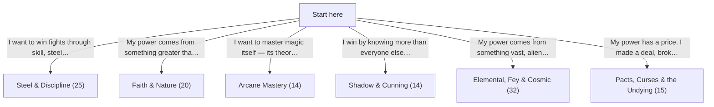

# Class Selector — Diagrams

The same questionnaire as [README.md](README.md), as Mermaid flowcharts (renders natively on
GitHub). The first diagram is the whole tree collapsed to its six top-level branches; the rest
break each branch out in full, down to every subclass leaf.

Generated from [decision-tree.json](decision-tree.json) — do not hand-edit.

## Overview

---

## Steel & Discipline (25 subclasses)

```mermaid
flowchart TD
  q_r1["Steel & Discipline"]
  q_r1a["Front-line bruiser"]
  q_r1 -->|"I plant my feet and out-tough everyone on…"| q_r1a
  leaf_fighter_champion(["Fighter: Champion"])
  q_r1a -->|"I shrug it off and keep swinging — simple…"| leaf_fighter_champion
  leaf_barbarian_path_of_the_berserker(["Barbarian: Path of the Berserker"])
  q_r1a -->|"I fly into a rage that makes me nearly im…"| leaf_barbarian_path_of_the_berserker
  leaf_barbarian_path_of_the_battlerager(["Barbarian: Path of the Battlerager"])
  q_r1a -->|"I turn my own armor into a weapon, spikes…"| leaf_barbarian_path_of_the_battlerager
  leaf_barbarian_path_of_the_juggernaut(["Barbarian: Path of the Juggernaut"])
  q_r1a -->|"I just keep moving forward, and nothing s…"| leaf_barbarian_path_of_the_juggernaut
  leaf_artificer_armorer(["Artificer: Armorer"])
  q_r1a -->|"I climb inside a suit of magical powered…"| leaf_artificer_armorer
  q_r1b["Tactical commander"]
  q_r1 -->|"I make the people around me better at fig…"| q_r1b
  leaf_fighter_battle_master(["Fighter: Battle Master"])
  q_r1b -->|"I call out precise maneuvers that trip, d…"| leaf_fighter_battle_master
  leaf_fighter_purple_dragon_knight(["Fighter: Purple Dragon Knight (Banneret)"])
  q_r1b -->|"I rally them with inspiring words and a b…"| leaf_fighter_purple_dragon_knight
  leaf_fighter_cavalier(["Fighter: Cavalier"])
  q_r1b -->|"I plant myself between them and every ene…"| leaf_fighter_cavalier
  leaf_cleric_war_domain(["Cleric: War Domain"])
  q_r1b -->|"I channel a war god's fury directly into…"| leaf_cleric_war_domain
  leaf_paladin_oath_of_the_crown(["Paladin: Oath of the Crown"])
  q_r1b -->|"I bind myself to their protection through…"| leaf_paladin_oath_of_the_crown
  q_r1c["Honor & personal mastery"]
  q_r1 -->|"I live and die by my own personal code of…"| q_r1c
  leaf_fighter_samurai(["Fighter: Samurai"])
  q_r1c -->|"An unbreakable code of resolve that keeps…"| leaf_fighter_samurai
  leaf_rogue_swashbuckler(["Rogue: Swashbuckler"])
  q_r1c -->|"A duelist's charm — one-on-one, blade and…"| leaf_rogue_swashbuckler
  leaf_paladin_oath_of_glory(["Paladin: Oath of Glory"])
  q_r1c -->|"Legendary feats that will be sung about f…"| leaf_paladin_oath_of_glory
  leaf_wizard_bladesinging(["Wizard: Bladesinging"])
  q_r1c -->|"A single blade and a song, moving as one."| leaf_wizard_bladesinging
  leaf_monk_way_of_the_kensei(["Monk: Way of the Kensei"])
  q_r1c -->|"A weapon that's become an extension of my…"| leaf_monk_way_of_the_kensei
  leaf_monk_way_of_the_open_hand(["Monk: Way of the Open Hand"])
  q_r1c -->|"My own fists and feet — no weapon needed…"| leaf_monk_way_of_the_open_hand
  q_r1d["Skirmisher & survivor"]
  q_r1 -->|"I stay light on my feet and read the terr…"| q_r1d
  leaf_rogue_thief(["Rogue: Thief"])
  q_r1d -->|"I'm fast, light-fingered, and always one…"| leaf_rogue_thief
  leaf_ranger_hunter(["Ranger: Hunter"])
  q_r1d -->|"I adapt my tactics to whatever prey I'm h…"| leaf_ranger_hunter
  leaf_ranger_monster_slayer(["Ranger: Monster Slayer"])
  q_r1d -->|"I hunt the things that hunt people — fien…"| leaf_ranger_monster_slayer
  leaf_monk_way_of_the_drunken_master(["Monk: Way of the Drunken Master"])
  q_r1d -->|"My footwork looks like a drunk's stumble,…"| leaf_monk_way_of_the_drunken_master
  leaf_druid_circle_of_the_moon(["Druid: Circle of the Moon"])
  q_r1d -->|"I turn into the beast myself."| leaf_druid_circle_of_the_moon
  q_r1e["Battle-caster"]
  q_r1 -->|"I want a taste of magic without giving up…"| q_r1e
  leaf_bard_college_of_valor(["Bard: College of Valor"])
  q_r1e -->|"It doesn't replace my weapon — it inspire…"| leaf_bard_college_of_valor
  leaf_bard_college_of_swords(["Bard: College of Swords"])
  q_r1e -->|"I dance through a fight, blade in one han…"| leaf_bard_college_of_swords
  leaf_wizard_school_of_evocation(["Wizard: School of Evocation"])
  q_r1e -->|"I don't fight with steel at all — I end f…"| leaf_wizard_school_of_evocation
  leaf_wizard_war_magic(["Wizard: War Magic"])
  q_r1e -->|"I use magic like a tactician uses terrain…"| leaf_wizard_war_magic
```

---

## Faith & Nature (20 subclasses)

```mermaid
flowchart TD
  q_r2["Faith & Nature"]
  q_r2a["Healer & protector"]
  q_r2 -->|"Keeping the people around me alive and wh…"| q_r2a
  leaf_cleric_life_domain(["Cleric: Life Domain"])
  q_r2a -->|"Overflowing divine healing, straight from…"| leaf_cleric_life_domain
  leaf_cleric_peace_domain(["Cleric: Peace Domain"])
  q_r2a -->|"I bind the party together so we protect a…"| leaf_cleric_peace_domain
  leaf_monk_way_of_mercy(["Monk: Way of Mercy"])
  q_r2a -->|"A touch that heals or harms, and fists th…"| leaf_monk_way_of_mercy
  leaf_artificer_alchemist(["Artificer: Alchemist"])
  q_r2a -->|"Alchemical formulas and a healer's flask…"| leaf_artificer_alchemist
  leaf_warlock_the_celestial(["Warlock: The Celestial"])
  q_r2a -->|"A pact with a being of pure light, healin…"| leaf_warlock_the_celestial
  leaf_sorcerer_divine_soul(["Sorcerer: Divine Soul"])
  q_r2a -->|"Divine power that was simply born into my…"| leaf_sorcerer_divine_soul
  q_r2b["Nature's champion"]
  q_r2 -->|"A bond with the wild places and things of…"| q_r2b
  leaf_cleric_nature_domain(["Cleric: Nature Domain"])
  q_r2b -->|"A god of the wild speaks through me."| leaf_cleric_nature_domain
  leaf_druid_circle_of_the_land(["Druid: Circle of the Land"])
  q_r2b -->|"The land itself lends me its magic, where…"| leaf_druid_circle_of_the_land
  leaf_druid_circle_of_the_shepherd(["Druid: Circle of the Shepherd"])
  q_r2b -->|"Spirits of beasts answer my call to guard…"| leaf_druid_circle_of_the_shepherd
  leaf_paladin_oath_of_the_ancients(["Paladin: Oath of the Ancients"])
  q_r2b -->|"An ancient oath sworn to the light that k…"| leaf_paladin_oath_of_the_ancients
  leaf_ranger_beast_master(["Ranger: Beast Master"])
  q_r2b -->|"An animal companion fights at my side, al…"| leaf_ranger_beast_master
  leaf_rogue_scout(["Rogue: Scout"])
  q_r2b -->|"I read the land and move through it like…"| leaf_rogue_scout
  q_r2c["Spirit-bound warrior"]
  q_r2 -->|"A spirit, ancestor, or creature that figh…"| q_r2c
  leaf_barbarian_path_of_the_totem_warrior(["Barbarian: Path of the Totem Warrior"])
  q_r2c -->|"The spirit of a totem animal empowers my…"| leaf_barbarian_path_of_the_totem_warrior
  leaf_barbarian_path_of_the_ancestral_guardian(["Barbarian: Path of the Ancestral Guardian"])
  q_r2c -->|"The ghosts of my ancestors guard my back."| leaf_barbarian_path_of_the_ancestral_guardian
  leaf_barbarian_path_of_the_beast(["Barbarian: Path of the Beast"])
  q_r2c -->|"My rage literally reshapes my body into a…"| leaf_barbarian_path_of_the_beast
  leaf_artificer_battle_smith(["Artificer: Battle Smith"])
  q_r2c -->|"A steel companion I built with my own two…"| leaf_artificer_battle_smith
  q_r2d["Radiant zealot"]
  q_r2 -->|"A devotion so total it burns away everyth…"| q_r2d
  leaf_barbarian_path_of_the_zealot(["Barbarian: Path of the Zealot"])
  q_r2d -->|"I fight like death itself has no hold on…"| leaf_barbarian_path_of_the_zealot
  leaf_paladin_oath_of_devotion(["Paladin: Oath of Devotion"])
  q_r2d -->|"An unbending, shining code of honor."| leaf_paladin_oath_of_devotion
  leaf_paladin_oath_of_redemption(["Paladin: Oath of Redemption"])
  q_r2d -->|"I'd rather turn an enemy from violence th…"| leaf_paladin_oath_of_redemption
  leaf_cleric_light_domain(["Cleric: Light Domain"])
  q_r2d -->|"I channel pure radiant fire against the d…"| leaf_cleric_light_domain
```

---

## Arcane Mastery (14 subclasses)

```mermaid
flowchart TD
  q_r3["Arcane Mastery"]
  q_r3a["Martial + arcane hybrid"]
  q_r3 -->|"Magic sharpens a weapon I'm already carry…"| q_r3a
  leaf_fighter_eldritch_knight(["Fighter: Eldritch Knight"])
  q_r3a -->|"I weave spells between my sword strikes —…"| leaf_fighter_eldritch_knight
  leaf_fighter_arcane_archer(["Fighter: Arcane Archer"])
  q_r3a -->|"Every arrow I loose carries a spell with…"| leaf_fighter_arcane_archer
  leaf_rogue_arcane_trickster(["Rogue: Arcane Trickster"])
  q_r3a -->|"I pick pockets with one hand and cast spe…"| leaf_rogue_arcane_trickster
  q_r3b["Divine-arcane crossover"]
  q_r3 -->|"My god and my spellbook agree on more tha…"| q_r3b
  leaf_cleric_arcana_domain(["Cleric: Arcana Domain"])
  q_r3b -->|"Magic itself is my domain, arcane and div…"| leaf_cleric_arcana_domain
  leaf_cleric_knowledge_domain(["Cleric: Knowledge Domain"])
  q_r3b -->|"I've dedicated myself to knowing everythi…"| leaf_cleric_knowledge_domain
  leaf_cleric_forge_domain(["Cleric: Forge Domain"])
  q_r3b -->|"I forge magic items the way a smith forge…"| leaf_cleric_forge_domain
  q_r3c["Pure arcane specialist"]
  q_r3 -->|"I want to specialize deep in one school o…"| q_r3c
  leaf_wizard_school_of_abjuration(["Wizard: School of Abjuration"])
  q_r3c -->|"Wards, shields, and turning aside every h…"| leaf_wizard_school_of_abjuration
  leaf_wizard_school_of_conjuration(["Wizard: School of Conjuration"])
  q_r3c -->|"Summoning allies and objects out of thin…"| leaf_wizard_school_of_conjuration
  leaf_wizard_school_of_divination(["Wizard: School of Divination"])
  q_r3c -->|"Glimpsing fate before it happens."| leaf_wizard_school_of_divination
  leaf_wizard_school_of_transmutation(["Wizard: School of Transmutation"])
  q_r3c -->|"Reshaping matter itself."| leaf_wizard_school_of_transmutation
  leaf_wizard_order_of_scribes(["Wizard: Order of Scribes"])
  q_r3c -->|"I bind my magic into a living, sentient b…"| leaf_wizard_order_of_scribes
  q_r3d["Inventive arcane crafter"]
  q_r3 -->|"I build or create things that shouldn't b…"| q_r3d
  leaf_bard_college_of_creation(["Bard: College of Creation"])
  q_r3d -->|"Impossible objects, even life itself — su…"| leaf_bard_college_of_creation
  leaf_sorcerer_clockwork_soul(["Sorcerer: Clockwork Soul"])
  q_r3d -->|"My own body, plated and gearworked like c…"| leaf_sorcerer_clockwork_soul
  leaf_artificer_artillerist(["Artificer: Artillerist"])
  q_r3d -->|"Magical cannons and turrets that do my fi…"| leaf_artificer_artillerist
```

---

## Shadow & Cunning (14 subclasses)

```mermaid
flowchart TD
  q_r4["Shadow & Cunning"]
  q_r4a["Master manipulator"]
  q_r4 -->|"Words. I can talk my way into or out of a…"| q_r4a
  leaf_bard_college_of_eloquence(["Bard: College of Eloquence"])
  q_r4a -->|"I can talk anyone into anything, on stage…"| leaf_bard_college_of_eloquence
  leaf_cleric_trickery_domain(["Cleric: Trickery Domain"])
  q_r4a -->|"Lies are just another tool of the trade —…"| leaf_cleric_trickery_domain
  leaf_cleric_order_domain(["Cleric: Order Domain"])
  q_r4a -->|"One word from me, and allies act instantl…"| leaf_cleric_order_domain
  leaf_wizard_school_of_enchantment(["Wizard: School of Enchantment"])
  q_r4a -->|"I don't ask — I make you agree with me."| leaf_wizard_school_of_enchantment
  q_r4b["Secret keeper & investigator"]
  q_r4 -->|"Knowing things nobody else knows yet."| q_r4b
  leaf_bard_college_of_lore(["Bard: College of Lore"])
  q_r4b -->|"I collect knowledge like treasure, with a…"| leaf_bard_college_of_lore
  leaf_bard_college_of_whispers(["Bard: College of Whispers"])
  q_r4b -->|"I trade in fear, blackmail, and the thing…"| leaf_bard_college_of_whispers
  leaf_monk_way_of_the_cobalt_soul(["Monk: Way of the Cobalt Soul"])
  q_r4b -->|"I hunt down dangerous magic and burn what…"| leaf_monk_way_of_the_cobalt_soul
  leaf_rogue_inquisitive(["Rogue: Inquisitive"])
  q_r4b -->|"I notice the one detail everyone else mis…"| leaf_rogue_inquisitive
  q_r4c["Silent killer"]
  q_r4 -->|"The fight is already over before anyone s…"| q_r4c
  leaf_monk_way_of_shadow(["Monk: Way of Shadow"])
  q_r4c -->|"I vanish into literal darkness and strike…"| leaf_monk_way_of_shadow
  leaf_rogue_assassin(["Rogue: Assassin"])
  q_r4c -->|"One perfect strike from hiding, and it's…"| leaf_rogue_assassin
  leaf_ranger_gloom_stalker(["Ranger: Gloom Stalker"])
  q_r4c -->|"I hunt from the tree line, where the ligh…"| leaf_ranger_gloom_stalker
  leaf_paladin_oath_of_vengeance(["Paladin: Oath of Vengeance"])
  q_r4c -->|"I've sworn to end one target, whatever it…"| leaf_paladin_oath_of_vengeance
  q_r4d["Spymaster"]
  q_r4 -->|"I run the whole game from the shadows."| q_r4d
  leaf_rogue_mastermind(["Rogue: Mastermind"])
  q_r4d -->|"I direct my allies from thirty feet back…"| leaf_rogue_mastermind
  leaf_wizard_school_of_illusion(["Wizard: School of Illusion"])
  q_r4d -->|"Nothing you see around me is entirely rea…"| leaf_wizard_school_of_illusion
```

---

## Elemental, Fey & Cosmic (32 subclasses)

```mermaid
flowchart TD
  q_r5["Elemental, Fey & Cosmic"]
  q_r5a["Elemental & storm"]
  q_r5 -->|"Raw elemental force — storm, fire, and fu…"| q_r5a
  leaf_barbarian_path_of_the_storm_herald(["Barbarian: Path of the Storm Herald"])
  q_r5a -->|"My aura shifts with the seasons — desert…"| leaf_barbarian_path_of_the_storm_herald
  leaf_cleric_tempest_domain(["Cleric: Tempest Domain"])
  q_r5a -->|"I command thunder and lightning like a go…"| leaf_cleric_tempest_domain
  leaf_monk_way_of_the_four_elements(["Monk: Way of the Four Elements"])
  q_r5a -->|"I bend the four elements into martial art…"| leaf_monk_way_of_the_four_elements
  leaf_sorcerer_storm_sorcery(["Sorcerer: Storm Sorcery"])
  q_r5a -->|"My magic and lightning are one — I can ev…"| leaf_sorcerer_storm_sorcery
  leaf_druid_circle_of_wildfire(["Druid: Circle of Wildfire"])
  q_r5a -->|"Fire itself answers me, and a fire spirit…"| leaf_druid_circle_of_wildfire
  q_r5b["Mind & psionics"]
  q_r5 -->|"The power of the mind itself."| q_r5b
  leaf_fighter_psi_warrior(["Fighter: Psi Warrior"])
  q_r5b -->|"I shape psychic energy into armor and wea…"| leaf_fighter_psi_warrior
  leaf_rogue_soulknife(["Rogue: Soulknife"])
  q_r5b -->|"I materialize a blade made of pure psychi…"| leaf_rogue_soulknife
  leaf_sorcerer_aberrant_mind(["Sorcerer: Aberrant Mind"])
  q_r5b -->|"Alien knowledge lives in my head, and it…"| leaf_sorcerer_aberrant_mind
  leaf_monk_way_of_the_astral_self(["Monk: Way of the Astral Self"])
  q_r5b -->|"I project spectral fists and a spirit-bod…"| leaf_monk_way_of_the_astral_self
  q_r5c["Fey & dreams"]
  q_r5 -->|"Something whimsical, beautiful, and a lit…"| q_r5c
  leaf_bard_college_of_glamour(["Bard: College of Glamour"])
  q_r5c -->|"My performances captivate a room like fey…"| leaf_bard_college_of_glamour
  leaf_ranger_fey_wanderer(["Ranger: Fey Wanderer"])
  q_r5c -->|"I walk the border of the Feywild, equal p…"| leaf_ranger_fey_wanderer
  leaf_warlock_the_archfey(["Warlock: The Archfey"])
  q_r5c -->|"I made a pact with a fey lord or lady of…"| leaf_warlock_the_archfey
  leaf_druid_circle_of_dreams(["Druid: Circle of Dreams"])
  q_r5c -->|"I bring healing dreams and starlight into…"| leaf_druid_circle_of_dreams
  q_r5d["Cosmic & the beyond"]
  q_r5 -->|"Something far bigger than this world."| q_r5d
  q_r5d1["Beyond the veil"]
  q_r5d -->|"Something vast is out there, and dangerou…"| q_r5d1
  leaf_warlock_the_great_old_one(["Warlock: The Great Old One"])
  q_r5d1 -->|"I made a pact with an alien intelligence…"| leaf_warlock_the_great_old_one
  leaf_warlock_the_fathomless(["Warlock: The Fathomless"])
  q_r5d1 -->|"Something ancient sleeps in the deep ocea…"| leaf_warlock_the_fathomless
  leaf_paladin_oath_of_the_watchers(["Paladin: Oath of the Watchers"])
  q_r5d1 -->|"I hunt the aberrations and horrors that s…"| leaf_paladin_oath_of_the_watchers
  leaf_fighter_echo_knight(["Fighter: Echo Knight"])
  q_r5d1 -->|"A spectral echo of myself fights beside m…"| leaf_fighter_echo_knight
  q_r5d2["Between moments"]
  q_r5d -->|"The cosmos bends slightly around me — tim…"| q_r5d2
  leaf_bard_college_of_spirits(["Bard: College of Spirits"])
  q_r5d2 -->|"I tell stories that call spirits from bey…"| leaf_bard_college_of_spirits
  leaf_druid_circle_of_stars(["Druid: Circle of Stars"])
  q_r5d2 -->|"I read fate in the stars, and become a li…"| leaf_druid_circle_of_stars
  leaf_wizard_chronurgy_magic(["Wizard: Chronurgy Magic"])
  q_r5d2 -->|"I bend time itself — slow it, rewind it,…"| leaf_wizard_chronurgy_magic
  leaf_wizard_graviturgy_magic(["Wizard: Graviturgy Magic"])
  q_r5d2 -->|"I bend gravity and space around my enemie…"| leaf_wizard_graviturgy_magic
  leaf_cleric_twilight_domain(["Cleric: Twilight Domain"])
  q_r5d2 -->|"I walk the line between day and night, gu…"| leaf_cleric_twilight_domain
  leaf_ranger_horizon_walker(["Ranger: Horizon Walker"])
  q_r5d2 -->|"I've walked every plane there is, and non…"| leaf_ranger_horizon_walker
  q_r5e["Draconic & wild"]
  q_r5 -->|"Something ancient, huge, or wildly unpred…"| q_r5e
  q_r5e1["Draconic blood & fire"]
  q_r5e -->|"Dragon's blood runs in me, and fire answe…"| q_r5e1
  leaf_sorcerer_draconic_bloodline(["Sorcerer: Draconic Bloodline"])
  q_r5e1 -->|"Scales, breath weapon, and a bloodline go…"| leaf_sorcerer_draconic_bloodline
  leaf_monk_way_of_the_ascendant_dragon(["Monk: Way of the Ascendant Dragon"])
  q_r5e1 -->|"I channel the essence of a dragon spirit…"| leaf_monk_way_of_the_ascendant_dragon
  leaf_ranger_drakewarden(["Ranger: Drakewarden"])
  q_r5e1 -->|"A drake hatched bonded to me, and we grow…"| leaf_ranger_drakewarden
  leaf_monk_way_of_the_sun_soul(["Monk: Way of the Sun Soul"])
  q_r5e1 -->|"Solar fire fills me and erupts from my fi…"| leaf_monk_way_of_the_sun_soul
  q_r5e2["Wild, giant & unpredictable"]
  q_r5e -->|"My power is huge, chaotic, or barely leas…"| q_r5e2
  leaf_barbarian_path_of_the_giant(["Barbarian: Path of the Giant"])
  q_r5e2 -->|"I grow into an actual giant, hurling boul…"| leaf_barbarian_path_of_the_giant
  leaf_fighter_rune_knight(["Fighter: Rune Knight"])
  q_r5e2 -->|"Giant runes carved into my armor let me g…"| leaf_fighter_rune_knight
  leaf_ranger_swarmkeeper(["Ranger: Swarmkeeper"])
  q_r5e2 -->|"A swarm of tiny fey spirits follows me ev…"| leaf_ranger_swarmkeeper
  leaf_barbarian_path_of_wild_magic(["Barbarian: Path of Wild Magic"])
  q_r5e2 -->|"My rage sets off unpredictable bursts of…"| leaf_barbarian_path_of_wild_magic
  leaf_sorcerer_wild_magic(["Sorcerer: Wild Magic"])
  q_r5e2 -->|"My spells are a gamble — glorious, chaoti…"| leaf_sorcerer_wild_magic
```

---

## Pacts, Curses & the Undying (15 subclasses)

```mermaid
flowchart TD
  q_r6["Pacts, Curses & the Undying"]
  q_r6a["Death's servants"]
  q_r6 -->|"Nothing yet — but death and I have an und…"| q_r6a
  leaf_cleric_death_domain(["Cleric: Death Domain"])
  q_r6a -->|"My god governs death as a natural, sacred…"| leaf_cleric_death_domain
  leaf_cleric_grave_domain(["Cleric: Grave Domain"])
  q_r6a -->|"I guard the border between life and death…"| leaf_cleric_grave_domain
  leaf_wizard_school_of_necromancy(["Wizard: School of Necromancy"])
  q_r6a -->|"I command the dead to fight for me."| leaf_wizard_school_of_necromancy
  leaf_druid_circle_of_spores(["Druid: Circle of Spores"])
  q_r6a -->|"Fungal spores and decay flow through my m…"| leaf_druid_circle_of_spores
  q_r6b["Cannot die, won't stay dead"]
  q_r6 -->|"I refuse to let death be the end of my st…"| q_r6b
  leaf_monk_way_of_the_long_death(["Monk: Way of the Long Death"])
  q_r6b -->|"I've touched death so many times it no lo…"| leaf_monk_way_of_the_long_death
  leaf_warlock_the_undying(["Warlock: The Undying"])
  q_r6b -->|"My patron has conquered death itself, and…"| leaf_warlock_the_undying
  leaf_warlock_the_undead(["Warlock: The Undead"])
  q_r6b -->|"My patron is literally undead, and its un…"| leaf_warlock_the_undead
  leaf_rogue_phantom(["Rogue: Phantom"])
  q_r6b -->|"A piece of the Shadowfell's death magic c…"| leaf_rogue_phantom
  q_r6c["Broken vows & dark bargains"]
  q_r6 -->|"A vow, broken, or a throne, terrified int…"| q_r6c
  leaf_paladin_oathbreaker(["Paladin: Oathbreaker"])
  q_r6c -->|"I broke my sacred oath, and dark power fi…"| leaf_paladin_oathbreaker
  leaf_paladin_oath_of_conquest(["Paladin: Oath of Conquest"])
  q_r6c -->|"I terrify my enemies into submission, and…"| leaf_paladin_oath_of_conquest
  leaf_warlock_the_fiend(["Warlock: The Fiend"])
  q_r6c -->|"I sold a piece of myself to an infernal p…"| leaf_warlock_the_fiend
  leaf_warlock_the_hexblade(["Warlock: The Hexblade"])
  q_r6c -->|"A sentient, cursed weapon chose me as its…"| leaf_warlock_the_hexblade
  q_r6d["Bound to something greater"]
  q_r6 -->|"My freedom, or my very blood."| q_r6d
  leaf_cleric_blood_domain(["Cleric: Blood Domain"])
  q_r6d -->|"Blood itself is the source and the price…"| leaf_cleric_blood_domain
  leaf_warlock_the_genie(["Warlock: The Genie"])
  q_r6d -->|"I'm bound in service to a genie, trapped…"| leaf_warlock_the_genie
  leaf_sorcerer_shadow_magic(["Sorcerer: Shadow Magic"])
  q_r6d -->|"The Shadowfell seeped into my magic and n…"| leaf_sorcerer_shadow_magic
```

